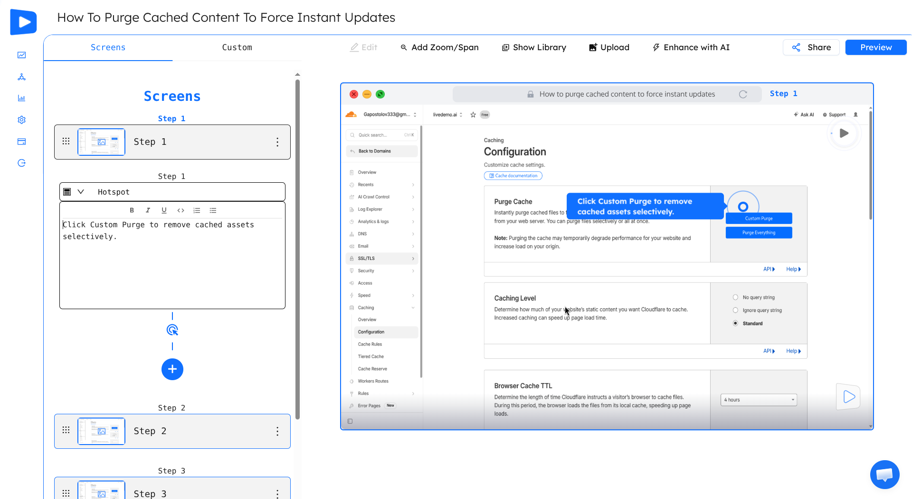
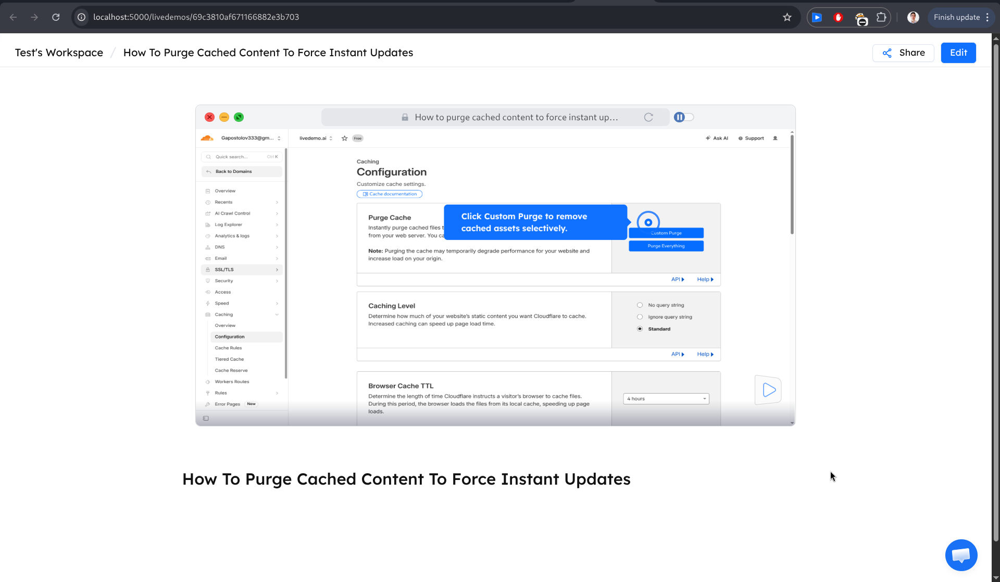

# livedemo-deploy

Local development deployment using Docker Compose. Runs three containers:


---







- **mongo** — MongoDB 8, exposed on port `27017` with a persistent local volume
- **livedemo-backend** — Backend API, exposed on port `3005`
- **livedemo-web-app** — Frontend app, exposed on port `5000`

All images are pulled from Docker Hub (`docker.io/livedemo/...`) — no local build required.

---

## Prerequisites

- [Docker](https://docs.docker.com/get-docker/) installed and running
- [Docker Compose](https://docs.docker.com/compose/install/) v2+ (`docker compose` command)

---

## Setup

### 1. Configure environment variables

Two env files are included as templates in `local/envs/`. Fill in any secrets or keys you need before starting:

**`local/envs/backend.env`** — variables for `livedemo-backend`:

Key variables to update:
| Variable | Description |
|---|---|
| `PRIVATE_AUTH_TOKEN` | Auth token for internal service calls |
| `OPENAI_API_KEY` | OpenAI API key |
| `STRIPE_SECRET_KEY` | Stripe secret key (use `sk_test_` for dev) |
| `AWS_ACCESS_KEY_ID` / `AWS_SECRET_ACCESS_KEY` | AWS credentials (optional for dev) |
| `ELEVENLABS_API_KEY` | ElevenLabs key (optional) |
| `MUX_TOKEN_ID` / `MUX_TOKEN_SECRET` | Mux credentials (optional) |

> `DB_URI` is pre-configured to point to the `mongo` container — do not change it.

**`local/envs/web-app.env`** — variables for `livedemo-web-app`:

Key variables to update:
| Variable | Description |
|---|---|
| `STRIPE_PUBLISHABLE` | Stripe publishable key (use `pk_test_` for dev) |
| `CAPTCHA_SITE_KEY` | reCAPTCHA site key (optional) |
| `GOOGLE_FONT_API_KEY` | Google Fonts API key (optional) |

---

### 2. Pull the latest images

```bash
docker compose -f local/docker-compose.yml pull
```

---

### 3. Start all containers

```bash
docker compose -f local/docker-compose.yml up -d
```

This will:
1. Start MongoDB and wait until it passes its health check
2. Start `livedemo-backend` once MongoDB is healthy
3. Start `livedemo-web-app` once the backend is up

---

## Accessing the services

| Service | URL |
|---|---|
| Web app | http://localhost:5000 |
| Backend API | http://localhost:3005 |
| MongoDB | mongodb://localhost:27017 |

---

## Common commands

```bash
# View logs for all containers
docker compose -f local/docker-compose.yml logs -f

# View logs for a specific container
docker compose -f local/docker-compose.yml logs -f livedemo-backend
docker compose -f local/docker-compose.yml logs -f livedemo-web-app

# Stop all containers (data is preserved)
docker compose -f local/docker-compose.yml down

# Stop and remove all data volumes (full reset)
docker compose -f local/docker-compose.yml down -v

# Restart a single container
docker compose -f local/docker-compose.yml restart livedemo-backend

# Pull latest images and recreate containers
docker compose -f local/docker-compose.yml pull && docker compose -f local/docker-compose.yml up -d
```

---

## Data persistence

MongoDB data and backend uploaded files are stored in named Docker volumes:

| Volume | Contents |
|---|---|
| `livedemo-deploy-2_mongo_data` | MongoDB database files |
| `livedemo-deploy-2_backend_data` | Demos, stories, and story request files |

To list volumes:

```bash
docker volume ls | grep livedemo
```

To remove volumes and start fresh:

```bash
docker compose -f local/docker-compose.yml down -v
```

---
## License

MIT License (see [`LICENSE`](LICENSE)).
